# lyceeDZ — UML Diagrams
---
## 1. Database Diagram (ERD)

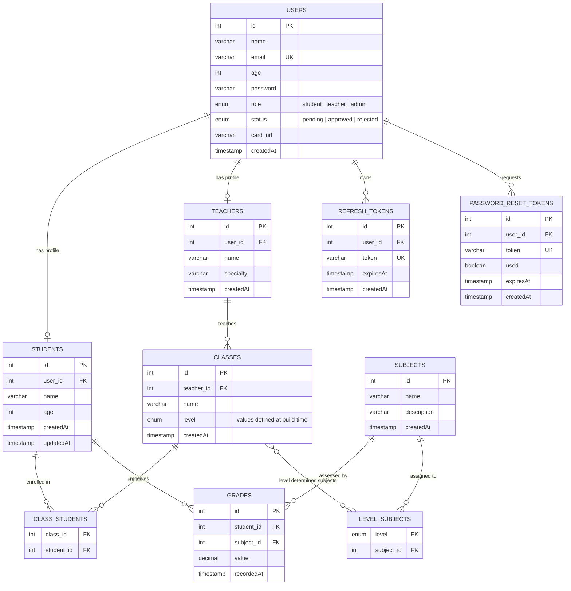

---

## 2. Use Case Diagrams

### 2.1 — Authentication

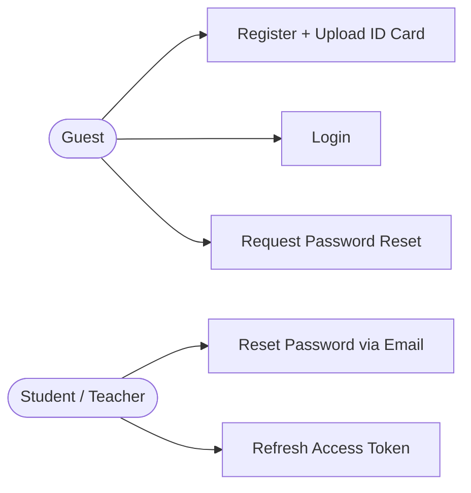

---

### 2.2 — Admin Panel

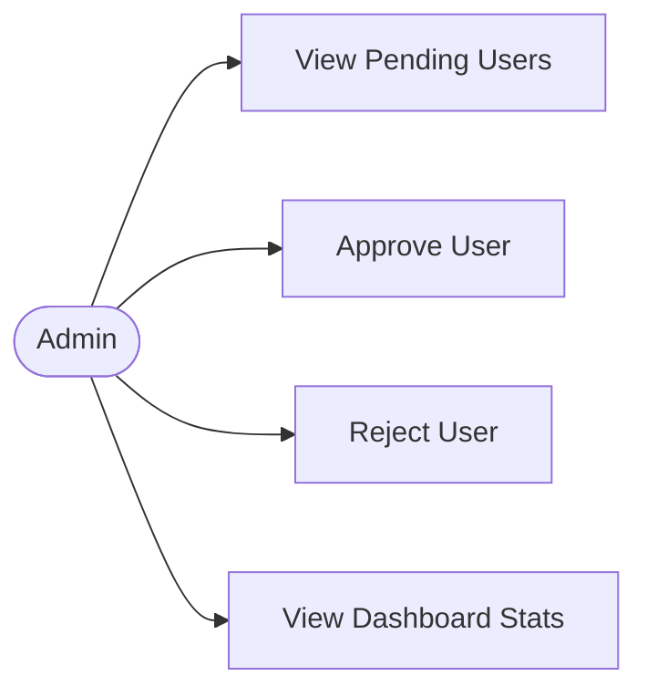

---

### 2.3 — Student Management

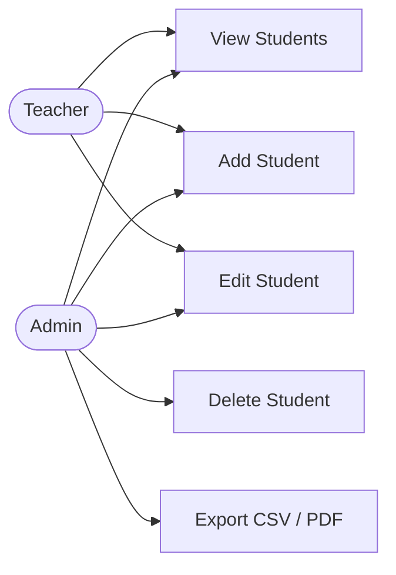

---

### 2.4 — Grades & Classes

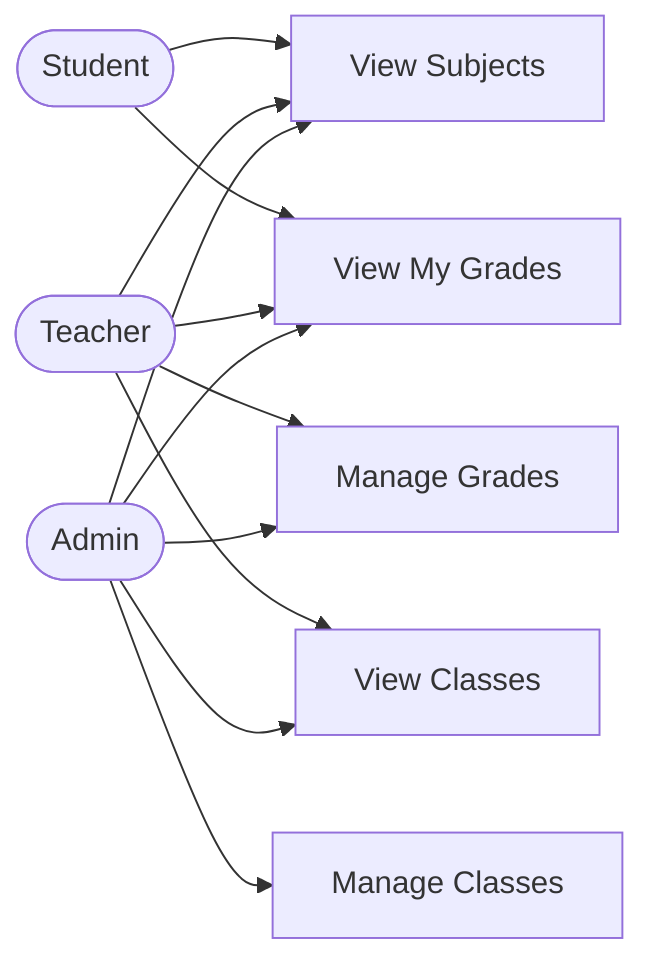

---

## 3. Sequence Diagrams

### 3.1 — Registration with ID Card Upload

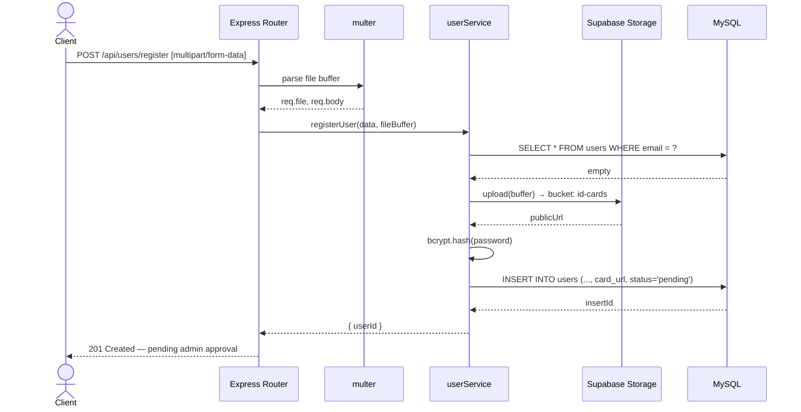

---

### 3.2 — Login & JWT Issuance

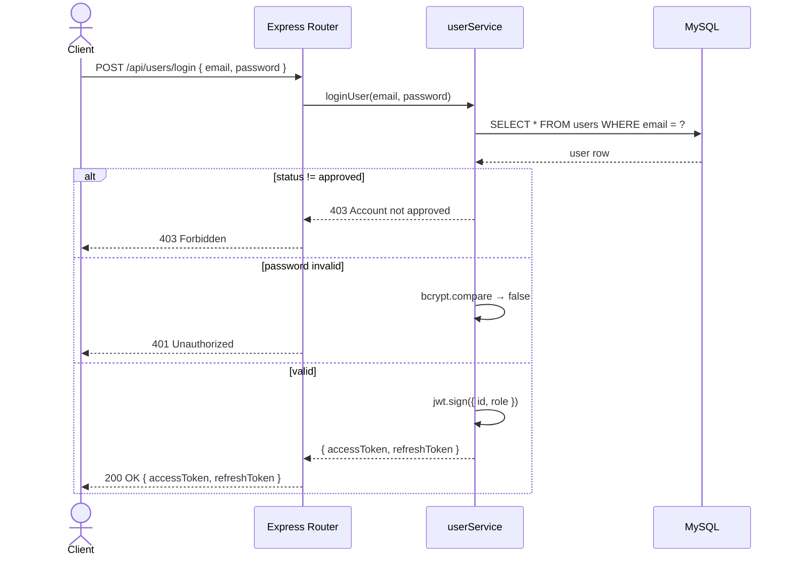

---

### 3.3 — Authenticated Request with Role Guard

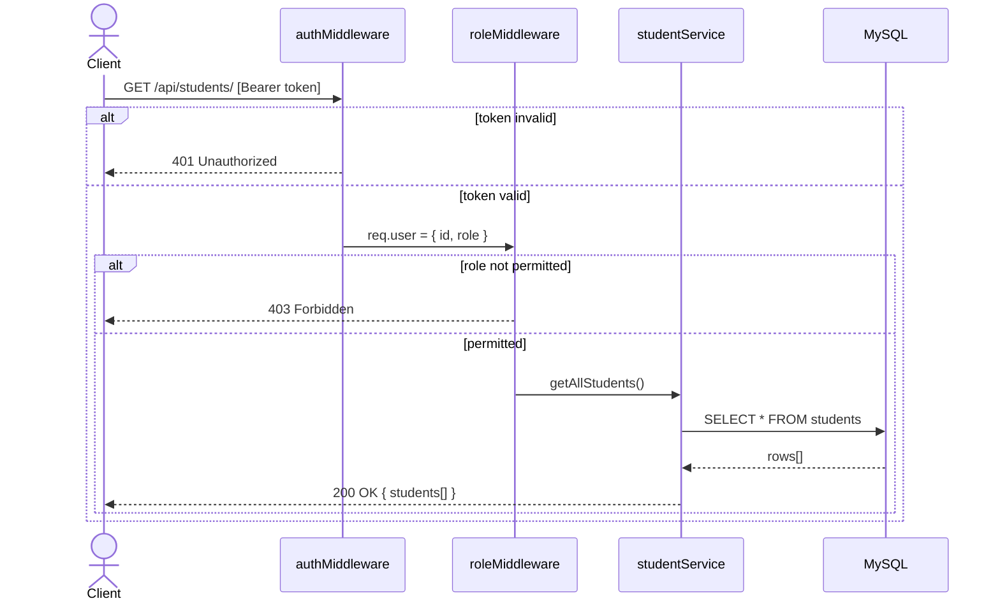

---

### 3.4 — Admin Approval Flow

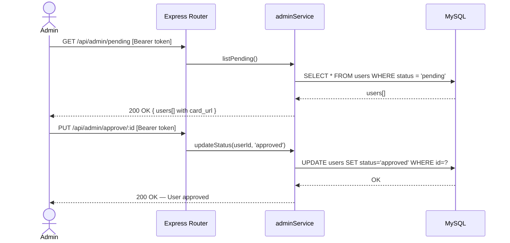

---

### 3.5 — Password Reset Flow

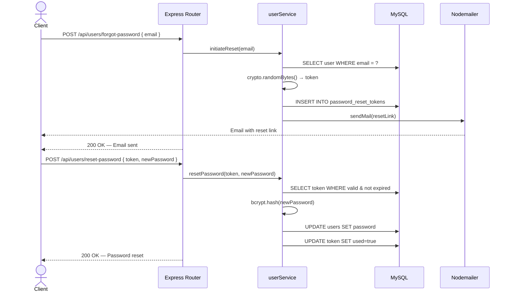

---

### 3.6 — Token Refresh Flow

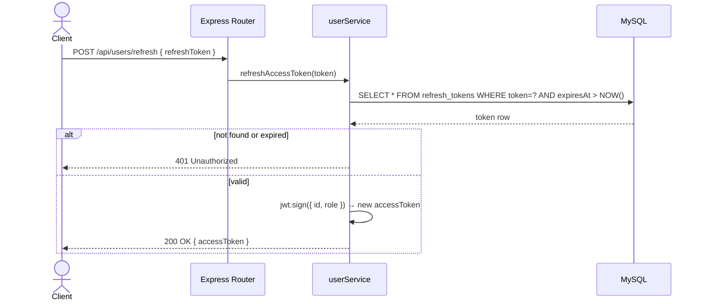

---
